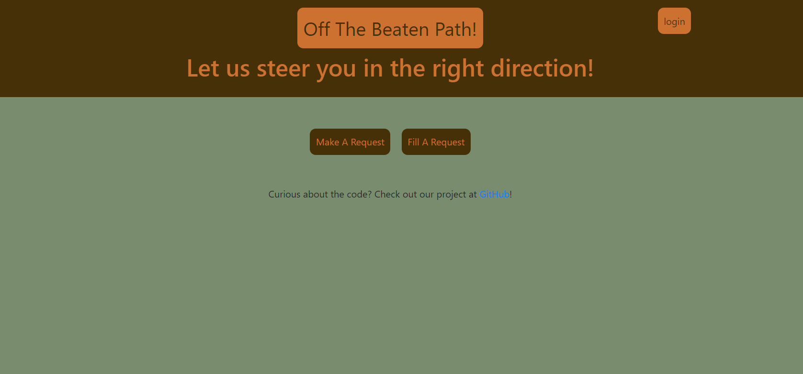

# Off-The-Beaten-Path

Let us steer you in the right direction! is your go-to off-roading assistance application. Whether you're stuck in mud, sand, or rocky terrain, simply submit a request detailing your situation and required tools, and our dedicated community is ready to provide the help you need, ensuring you navigate the trails with ease.

## Table of Contents
- [Description](#description)
- [Screenshots](#screenshots)
- [Technologies Used](#technologies-used)
- [Deployment](#deployment)
- [Features](#features)
- [Contribution Guidelines](#contribution-guidelines)
- [License](#license)
- [Questions](#questions)

## Description
Whether you find yourself mired in mud, navigating challenging rocky terrain, or facing any off-road predicament, our platform simplifies the process of getting help.

To use the app, adventurers can submit a detailed assistance request outlining their specific situation. The user-friendly form allows them to describe how their vehicle is stuck and specify the tools or assistance required for recovery. This information ensures that the rescuer arriving at the scene is well-prepared and equipped to tackle the unique challenges of each situation.

Conversely, experienced off-road enthusiasts looking to lend a hand can browse through incoming assistance requests and choose the ones that align with their skills and equipment. This two-way interaction fosters a supportive community of off-roading enthusiasts who share a passion for exploration and are ready to assist fellow adventurers in times of need.

Our platform prioritizes safety, efficiency, and camaraderie, making off-road excursions more enjoyable and worry-free. Whether you're a seasoned off-road expert or a newcomer seeking assistance, "Off The Beaten Path!" is the bridge that connects off-road enthusiasts and ensures everyone can explore with confidence. Let the off-road community have your back when the path gets tough!

### Screenshots
**Screenshots of application:**

## Technologies Used
This collaborative full-stack application is powered by Node.js and Express.js, creating a robust RESTful API. Handlebars.js serves as the template engine for seamless rendering of dynamic content. MySQL, along with the Sequelize ORM, is utilized for efficient database management, supporting both GET and POST routes for retrieving and adding new data.

For development, nodemon is employed to automatically restart the server upon code changes, facilitating a streamlined workflow.

Nodemailer, a Node.js module, is used to send emails and enhance the functionality of the application. This innovative addition allows users to incorporate their emails, providing a personalized account experience.

To test and interact with the API, the REST client extension for Visual Studio Code is utilized, offering a convenient alternative to external tools like Insomnia.

The project follows the Model-View-Controller (MVC) paradigm, ensuring a well-organized folder structure. Authentication is implemented through express-session and cookies, prioritizing user security. API keys and sensitive information are safeguarded using environment variables for enhanced privacy.

Deployment is achieved seamlessly using Heroku, with the application hosted live along with its data. The user interface is polished, responsive, and interactive, providing an engaging experience for users.

The project adheres to high-quality coding standards, encompassing file structure, naming conventions, and best practices for class/id naming, indentation, and quality comments.

## Deployment
Here we have out live site! You can visit it [here!](https://offthebeatenpath-ec05917799ad.herokuapp.com/)

## Features
**Off-Road Assistance Requests:** Users can submit assistance requests detailing their off-road predicaments, specifying the type of help and tools needed.

**Collaborative Support:** Experienced off-road enthusiasts can browse and take on assistance requests that align with their skills, fostering a supportive community.

**Dynamic Form:** The application provides a user-friendly form for submitting requests, allowing users to describe their stuck situation and required assistance.

**Advanced Technologies:** Leveraging Node.js, Express.js, and Handlebars.js, the application seamlessly combines a robust back end with an intuitive front end.

**Database Management:** MySQL and Sequelize ORM are employed to handle the database, ensuring efficient storage and retrieval of user requests.

**Authentication Security:** User authentication is implemented using express-session and cookies, prioritizing the protection of user information.

**Innovative Addition:** The project incorporates Nodemailer, a popular Node.js module, enhancing functionality and introducing a unique element to the off-road assistance experience.

**Responsive and Polished UI:** The user interface is designed to be responsive, providing an optimal viewing experience across various devices.

**Heroku Deployment:** The application is seamlessly deployed using Heroku, ensuring accessibility along with its data.

## Contribution Guidelines
The collaboration between Conner, Gisela, and Kiki has made a magical site that is open to collaboration. If you choose to do so, open an issue and modify any changes you would like to see on a feature branch and wait for approval before merging to the main branch.

## License
This application has no License.

## Questions
Have additional questions? [Contact Gisela through her GitHub account](https://github.com/PotionSela). [Contact Conner through his GitHub](https://github.com/Conartisttt). [Contact Kiki through her GitHub](https://github.com/AngelCatLatte)